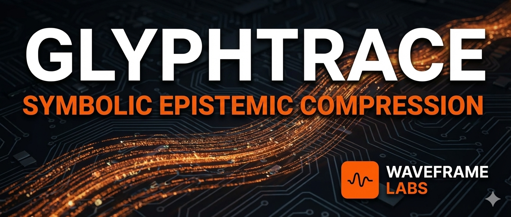

<p align="center">
  
</p>

# Glyphtrace

A symbolic epistemic compression format for representing scientific artifacts as compact,
machine-expandable semantic traces.  
Glyphtrace enables knowledge to be referenced, reconstructed, audited, or regenerated using a
minimal symbolic string rather than a full document.

[](https://waveframelabs.org)
[](https://github.com/Waveframe-Labs/Aurora-Research-Initiative)
[](https://doi.org/10.5281/zenodo.18057686)  
[](https://orcid.org/0009-0006-6043-9295)
[](LICENSE)

---

## Purpose

Glyphtrace is a foundational research project under Waveframe Labs focused on
**meaning-level compression, provenance encoding, and epistemic traceability**.

Goal:
> Represent a full research artifact as a short symbolic string that can be expanded back into
> the original idea, workflow, or document using deterministic rules and tooling.

This repository will evolve into:

- The **Glyphtrace Specification**
- Syntax rules, grammar, and encoding guidelines
- Example traces + round-trip demonstrations
- Converter experiments and reconstruction prototypes
- Standardization pathway under Waveframe governance

---

## Status

`v0.0.1 — Initial scaffolding`

This is an exploratory research phase.  
Specification, examples, and tooling will develop incrementally.

---

## Directory Overview

```
Glyphtrace/
├── README.md
├── LICENSE
├── CITATION.cff
├── CHANGELOG.md
├── docs/
│ └── GLYPHTRACE_CONCEPT.md
├── examples/
│ └── example_traces.md
└── GLYPHTRACE_SPEC_DRAFT.md
```

---

## Roadmap (High-Level)

- Establish core documentation foundation
- Formalize trace syntax & symbol grammar
- Expand examples and round-trip demos
- Build converter prototype for encoding/decoding
- Position for future standardization across Waveframe Labs

---

<div align="center">
  <sub>© 2025 Waveframe Labs — Independent Open-Science Research Entity • Governed under the Aurora Research Initiative (ARI)</sub>
</div>
